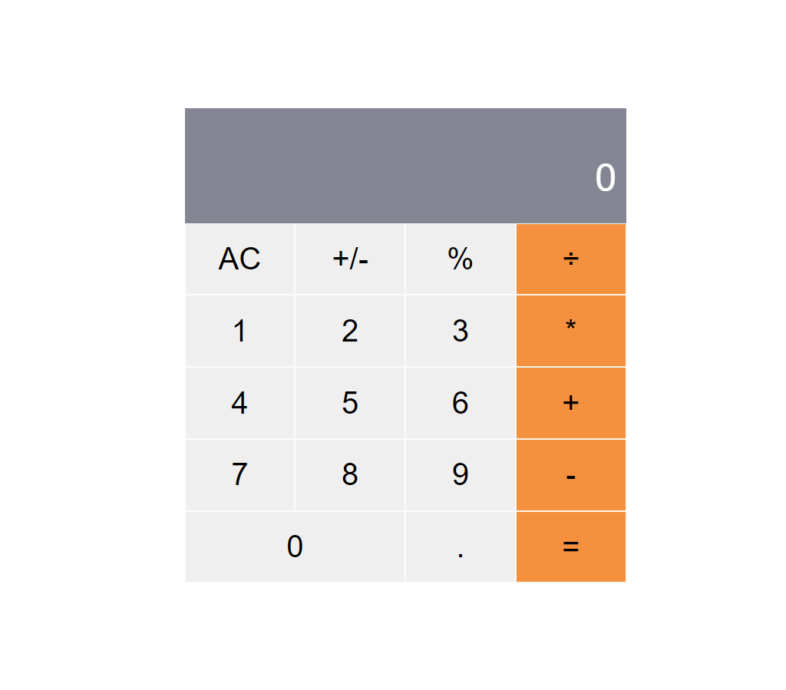

# Project Name

> Caculator that helps people to do different mathematical operations.

## Built With

- Javascript
- React
- CSS

## Live Demo

 COMING SOON
<!-- [Live Demo Link](https://livedemo.com) -->

## Getting Started

**This is an example of how you may give instructions on setting up your project locally.**
**Modify this file to match your project, remove sections that don't apply. For example: delete the testing section if the currect project doesn't require testing.**

To get a local copy up and running follow these simple example steps.

## Setup

This project was bootstrapped with [Create React App](https://github.com/facebook/create-react-app).

### Available Scripts

In the project directory, you can run:

#### `npm start`

Runs the app in the development mode.\
Open [http://localhost:3000](http://localhost:3000) to view it in the browser.

The page will reload if you make edits.\
You will also see any lint errors in the console.

#### `npm test`

Launches the test runner in the interactive watch mode.\

#### `npm run build`

Builds the app for production to the `build` folder.\
It correctly bundles React in production mode and optimizes the build for the best performance.

The build is minified and the filenames include the hashes.\
App is ready to be deployed!
## Author

👤 **Laylo Khodjaeva**

- GitHub: [@Laylo309](https://github.com/Laylo309)
- Twitter: [@Laylo](https://twitter.com/home?lang=en)
- LinkedIn: [LayloKhodjaeva](https://www.linkedin.com/in/laylo-khodjaeva-05a972207/)

## 🤝 Contributing

Contributions, issues, and feature requests are welcome!

Feel free to check the [issues page](../../issues/).

## Show your support

Give a ⭐️ if you like this project!
## 📝 License

This project is [MIT](./MIT.md) licensed.

